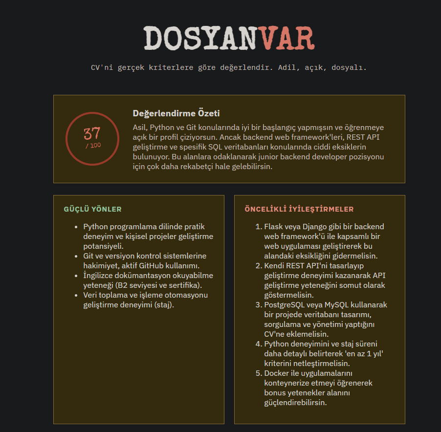
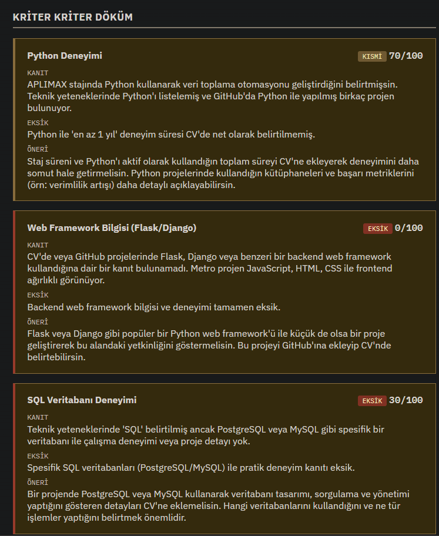

# DosyanVar

CV'ni gerçek iş kriterlerine karşı değerlendiren, tarayıcıda çalışan küçük bir araç.
PDF'ini yükle, bir iş ilanı ya da kriter listesi yapıştır, istersen GitHub kullanıcı
adını ekle — Gemini kriter kriter puanlayıp somut, uygulanabilir geliştirme
önerileri döner.

Bu proje [interviewstreet/hiring-agent](https://github.com/interviewstreet/hiring-agent)
projesinden ilham alınarak yapıldı, ama akışı tersine çevirir: işverenin adayı
puanlaması yerine, adayın **kendi** CV'sini bir ilana göre önceden test etmesini
sağlar.





## Özellikler

- 📄 PDF CV'den metin çıkarımı (PyMuPDF)
- 🧠 Google Gemini ile kriter kriter puanlama, kanıt, eksik ve öneri
- 🐙 Opsiyonel GitHub sinyalleri (public repo/profil verisi) — açık kaynak /
  proje odaklı kriterlerde kanıt olarak kullanılır
- 🗂️ Tek sayfalık, sade web arayüzü

## Kurulum

```bash
git clone https://github.com/asildavutoglu/dosyanvar.git
cd dosyanvar
python -m venv .venv
source .venv/bin/activate   # Windows: .venv\Scripts\activate
pip install -r requirements.txt
cp .env.example .env
```

`.env` dosyasını aç ve `GEMINI_API_KEY` değerini doldur. Ücretsiz bir anahtarı
[Google AI Studio](https://aistudio.google.com/apikey) üzerinden alabilirsin.
`GITHUB_TOKEN` opsiyoneldir, sadece GitHub API rate limitini artırmak için.

## Çalıştırma

```bash
python app.py
```

Sonra tarayıcıda `http://localhost:5000` adresine git.

## Nasıl çalışır

1. `modules/pdf_extract.py` — yüklenen PDF'i düz metne çevirir.
2. `modules/github_signals.py` — (opsiyonel) verilen kullanıcı adının public
   profil ve repo verisini GitHub API'sinden çeker.
3. `modules/evaluator.py` — CV metnini, kriterleri ve varsa GitHub verisini
   Gemini'ye tek bir isteğe paketleyip yapılandırılmış bir JSON değerlendirme
   ister: genel puan, kriter kriter döküm (kanıt / eksik / öneri), güçlü
   yönler ve öncelikli iyileştirmeler.
4. `app.py` bu sonucu `/evaluate` endpoint'inden JSON olarak döner, frontend
   (`static/script.js`) da bunu "dosya/damga" temalı bir rapor olarak render
   eder.

## Sınırlamalar

- Şu an sadece metin tabanlı (taranmamış) PDF CV'ler destekleniyor.
- Değerlendirme bir LLM tarafından üretilir; kesin bir gerçek değil, CV'ni
  gözden geçirmen için bir başlangıç noktasıdır.
- GitHub verisi sadece public bilgilerle sınırlıdır.

## Lisans

MIT — bkz. [LICENSE](LICENSE).
